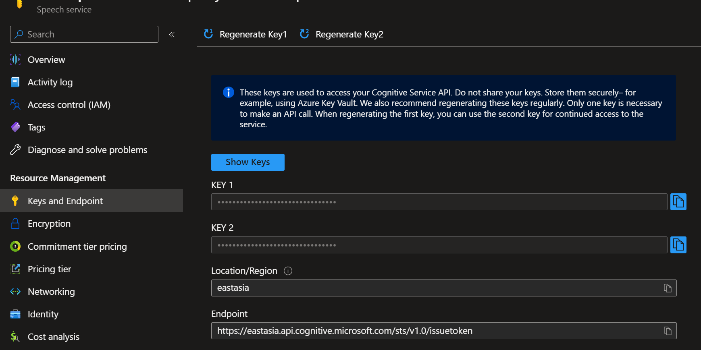
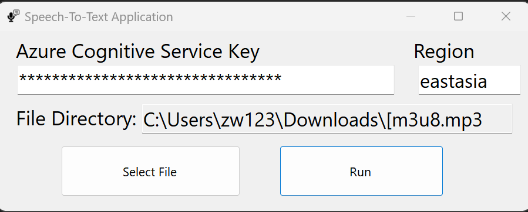

## Speech-To-Text WinForm App

It is a simple interface to connect to Azure Cognitive Service (ACS) to recognize the speech in Chinese (Traditional) and English (US). It leverages the API of ACS in C# and `ffmpeg` for converting any media file to the acceptable format for ACS.

### Prerequisites

1. Azure subscription - [Create one for free](https://azure.microsoft.com/en-us/free/cognitive-services/)

1. [Create a Speech resource in the Azure portal.](https://portal.azure.com/#create/Microsoft.CognitiveServicesSpeechServices)

1. [Download the application from my Dropbox](https://www.dropbox.com/s/xvxxfgi5kxoy3of/SpeechToTextApp.zip?dl=0)

### How-To

1. Once you created the speech resource, you can go to resource and go to **Keys and Endpoint** to get your key and region.

2. Open `SpeechToTextApp.exe`. Copy and paste your key and region on the application.

3. Select the file and run!

### Reference

1. [Quickstart: Create captions with speech to text](https://learn.microsoft.com/en-us/azure/cognitive-services/speech-service/captioning-quickstart?tabs=windows%2Cterminal&pivots=programming-language-csharp)

####

1. Please take risk to use this software, we are not responsible for any cost you made during using this software.
